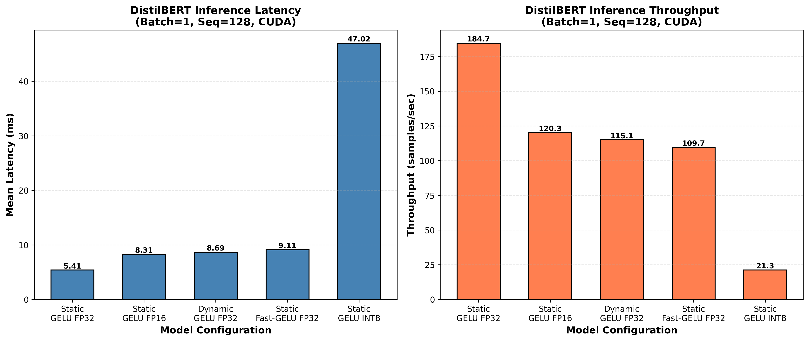
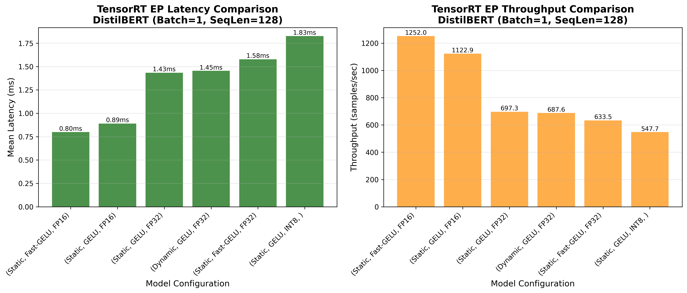
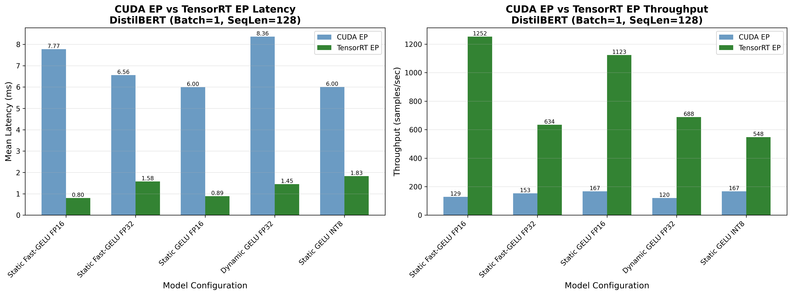

# ⚡ NVIDIA GPU Inference Performance Study
### Diagnosing execution ceilings across ONNX Runtime and TensorRT

---

## Overview

This project is a **systematic performance diagnosis of Transformer inference on NVIDIA GPUs**, comparing three increasingly specialized execution stacks:

1. **ONNX Runtime + CUDA Execution Provider**
2. **ONNX Runtime + TensorRT Execution Provider**
3. **Native TensorRT engines**

Rather than chasing headline speedups, the goal is to **identify where performance gains flatten**, explain *why*, and surface which bottlenecks remain once modern GPU inference engines are fully engaged.

This mirrors a prior CoreML performance study and applies the same methodology to NVIDIA GPUs.

---

## Key Questions

This project answers the following practical questions:

- When does ONNX Runtime + CUDA EP already saturate the GPU?
- What incremental benefit does TensorRT (via ORT or native) actually provide?
- When do abstraction layers stop mattering?
- Where does inference latency stop being kernel-bound and become orchestration-bound?
- Which optimization levers still move the needle for small, static inference workloads?

---

## Experimental Setup

### Hardware
- GPU: NVIDIA RTX 3060 Ti
- CPU: AMD Ryzen 3700X
- OS: Windows
- CUDA / Driver versions documented in `results/`

### Models
- DistilBERT
- BERT-base (select experiments)

### Inference Regimes
- Batch size: 1 (primary)
- Sequence length: 128 (baseline), extended sweeps
- Precision: FP32, FP16 (INT8 in progress)
- Static and dynamic shape configurations

### Metrics
- Mean latency
- p50 / p90 / p99 latency
- Throughput (samples/sec)
- Nsight Systems timelines for attribution

---

## Methodology

To avoid misleading conclusions profiling with Nsight Systems:

- One-time initialization effects are excluded
- Warmup runs are separated from steady-state profiling
- GPU synchronization is explicit
- Identical inputs are used across runtimes
- Nsight Systems is used to attribute time across CPU, runtime, and GPU

The focus is **diagnosis**, not just benchmarking.

---

## Findings Summary

### 1. Baseline: CPU vs ORT CUDA EP

For small, fixed inference regimes (B=1, S=128), ONNX Runtime with CUDA EP already delivers high GPU utilization. Kernel execution dominates total time, and CPU overhead is modest but non-negligible.

**Takeaway:** CUDA EP is not a fallback path — it is already competitive for well-supported Transformer models.


---

### 2. TensorRT EP: consistent fusion across configurations





### 3. TensorRT EP and native TensorRT converge

For static FP16 inference, **TensorRT EP and native TensorRT show nearly identical mean latency and throughput**. Differences primarily appear in tail latency (p99), not steady-state performance.

**Takeaway:** Once TensorRT kernels are engaged, the execution path — not the engine — becomes the limiting factor.

---

### 4. Kernel-level optimization reaches a ceiling quickly

Nsight Systems analysis shows:

- Major subgraphs are already fused (TensorRT / Myelin)
- Remaining kernels are small and launch-bound
- Additional kernel fusion yields diminishing returns

At this point, further engine-level tuning produces predictable but marginal gains.

---

### 5. Runtime orchestration becomes the bottleneck

For small, static workloads:

- CPU kernel launch overhead
- Submission jitter
- Synchronization behavior

become dominant contributors to latency variance.

This explains why:
- mean latency stabilizes
- p99 remains sensitive
- further kernel tuning feels ineffective

---

### 6. CUDA Graphs address the remaining bottleneck

CUDA Graph capture (a runtime-level optimization) reduces repeated CPU submission overhead by replaying a pre-recorded GPU execution graph.

For static inference paths, this:
- tightens tail latency
- reduces CPU involvement
- improves execution determinism

**Key insight:** once kernels are optimized, *systems orchestration* becomes the next optimization frontier.

---

## INT8 Status (In Progress)

INT8 optimization is currently being evaluated as an extension:

- Calibration and Q/DQ overhead can offset benefits at small batch/sequence sizes
- Early evidence suggests INT8 is more impactful at larger workloads
- Final results will be documented as an appendix

INT8 is treated as a **bonus optimization**, not a prerequisite for the study’s conclusions.

---

## Repository Structure

```text
nvidia-gpu-performance-study/
├── README.md
├── scripts/
│   ├── export_to_onnx.py
│   ├── run_cpu_bench.py
│   ├── run_gpu_bench.py
│   ├── run_seq_sweep_cpu.py
│   ├── run_seq_sweep_gpu.py
│   ├── compare_cpu_gpu.py
│   └── plotting utilities
├── results/
│   ├── plots/
│   ├── csv/
│   └── txt/        # profiler summaries and notes
└── notebooks/
